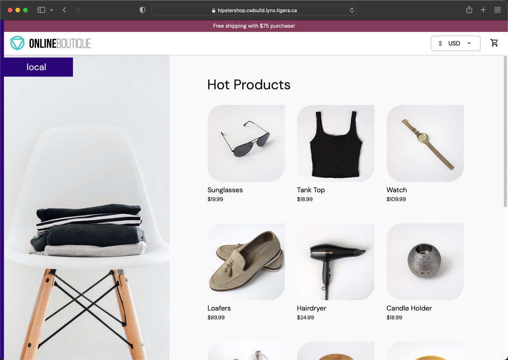

# 0. Lab Setup

## Environment

This workbook is designed around and already deployed kubernetes cluster with Calico installed as the CNI with the cluster connected to Calico Cloud.

We will be using an example microservices based application call Online Boutique or Hipstershop as the basis for all labs and examples. This application will be deployed in its own namespace within the cluster.

For testing, we will also be deploying a tools container called Network-Multitool which has built in tools for testing and troubleshooting within the cluster.

## Setup Lynx Lab with Calico Cloud

*If you are following along in your own lab, refer to [Project Calico Getting Started](https://projectcalico.docs.tigera.io/getting-started/kubernetes/) and [Connect your cluster](https://docs.calicocloud.io/get-started/connect/) to get started*

To connect the Lynx lab environment to Calico Cloud, first we need to install Project Calico as the CNI. This will enable networking in the cluster.

For more details on the install of Project Calico, refer to the [Online Documentation](https://projectcalico.docs.tigera.io/getting-started/kubernetes/).

### Install Project Calico as CNI

First, we will install the Tigera Operator on the cluster:

```bash
kubectl create -f https://projectcalico.docs.tigera.io/archive/v3.22/manifests/tigera-operator.yaml
```

Next, we apply the custom resource manifest to install Calico as the CNI.

```yaml
kubectl apply -f -<<EOF
# This section includes base Calico installation configuration.
# For more information, see: https://docs.projectcalico.org/v3.21/reference/installation/api#operator.tigera.io/v1.Installation
apiVersion: operator.tigera.io/v1
kind: Installation
metadata:
  name: default
spec:
  # Configures Calico networking.
  calicoNetwork:
    # Note: The ipPools section cannot be modified post-install.
    ipPools:
    - blockSize: 26
      cidr: 10.48.0.0/24
      encapsulation: None
      natOutgoing: Enabled
      nodeSelector: all()
---
# This section configures the Calico API server.
# For more information, see: https://docs.projectcalico.org/v3.21/reference/installation/api#operator.tigera.io/v1.APIServer
apiVersion: operator.tigera.io/v1
kind: APIServer
metadata:
    name: default
spec: {}
EOF
```

After a couple of minutes, all nodes should now show as Ready.
```bash
kubectl get nodes
```
```bash
NAME                                         STATUS   ROLES                  AGE   VERSION
ip-10-0-1-20.ca-central-1.compute.internal   Ready    control-plane,master   9d    v1.21.7
ip-10-0-1-30.ca-central-1.compute.internal   Ready    worker                 9d    v1.21.7
ip-10-0-1-31.ca-central-1.compute.internal   Ready    worker                 9d    v1.21.7
```

With the cluster online, we can now take the installer string from our Calico Cloud Connect Cluster wizard and run it on our bastion host.
```bash
curl https://installer.calicocloud.io/<unique_string>-management_install.sh | bash
```

The install should complete after a couple of minutes and your cluster will show as connected in the Cluster Manager in Calico Cloud.


## Deploying the Application

**Create a Namespace for the application**

First, let's create a namespace called 'hipstershop' for the application:

```bash
kubectl create namespace hipstershop
```

**Deploy the application**

Next we will deploy the Online Boutique (Hipstershop) application to the namespace. This will install the application from the Google repository.

```bash
kubectl apply -n hipstershop -f https://raw.githubusercontent.com/GoogleCloudPlatform/microservices-demo/main/release/kubernetes-manifests.yaml
```


**Verify Pods are Running**

After deploying the application, wait for all pods to come online in the namespace, this will take a couple of minutes.
```bash
kubectl get pods -n hipstershop
```

The output should look similar to below.
```bash
NAME                                     READY   STATUS    RESTARTS   AGE
adservice-776f7f9bb-z7pjc                1/1     Running   0          50s
cartservice-55cd86d896-5mxh4             1/1     Running   0          51s
checkoutservice-5944bf5f96-dqrf5         1/1     Running   0          52s
currencyservice-5478cb46cd-ss22v         1/1     Running   0          51s
emailservice-97556899b-ntr69             1/1     Running   0          52s
frontend-746879fd55-t9hnz                1/1     Running   0          52s
loadgenerator-6cdf76b6d4-wvg64           1/1     Running   0          51s
paymentservice-6b74ff9f78-pknsj          1/1     Running   0          52s
productcatalogservice-86ddd945bb-9zmh8   1/1     Running   0          51s
recommendationservice-955dccff4-mp6j6    1/1     Running   0          52s
redis-cart-5b569cd47-cm8tt               1/1     Running   0          50s
shippingservice-7784dcb6c8-p6pms         1/1     Running   0          51s
```


**Deploy Network-MultiTool Pod in the default namespace**

The Network-MultiTool pod will be used in two namespaces to test the created network policies.

First, deploy the MultiTool into the default namespace:

```bash
kubectl run multitool --image=wbitt/network-multitool
```

**Deploy a second copy of Network-Multitool to the hipstershop namespace**

Next, deploy a copy of the Mutlitool into the hipstershop namespace:

```bash
kubectl run multitool -n hipstershop --image=wbitt/network-multitool
```

Verify that both pods are up and running:

```bash
kubectl get pods -A | grep multitool
```

Both pods should be Running:

```bash
default                      multitool                                        1/1     Running            0              12s
hipstershop                  multitool                                        1/1     Running            0              31m
```

**Test Connectivity to frontend-external service or nodeport**

First, get the IP address of the frontend-external service:
```bash
kubectl get svc -n hipstershop frontend-external
```
```bash
NAME                TYPE       **CLUSTER-IP**      EXTERNAL-IP   PORT(S)        AGE
frontend-external   NodePort   **10.49.14.192**  <none>        80:32747/TCP   4h50m
```

Next, connect to the shell inside of the Network-Multitool pod in default namespace using kubectl exec:
```bash
kubectl exec multitool --stdin --tty -- /bin/bash
```

Now we'll use curl to verify we can reach the web frontend of the application (your **Cluster-IP** address might be different in your cluster, replace it accordingly):
```bash
bash-5.1# curl -I 10.49.14.192
HTTP/1.1 200 OK
Set-Cookie: shop_session-id=1939f999-1237-4cc7-abdb-949423eae483; Max-Age=172800
Date: Wed, 26 Jan 2022 20:14:20 GMT
Content-Type: text/html; charset=utf-8
```

### Setup Ingress to the Hipstershop (optional)

*If you are not running within the Tigera Lynx lab, you will need to setup ingress according to your environment.*

Now that the application is deployed and running, let's enable ingress access to it by creating an ingress using the following spec:
```yaml
kubectl apply -f -<<EOF
apiVersion: networking.k8s.io/v1
kind: Ingress
metadata:
  name: hipstershop-ingress
  namespace: hipstershop
spec:
  rules:
    - host: "hipstershop.template.lynx.tigera.ca"
      http:
        paths:
          - path: /
            pathType: Prefix
            backend:
              service:
                name: frontend
                port:
                  number: 80
EOF
```
>Manfest: [Ingress Manifest](manifests/0.2-hipstershop-ingress.yaml)

After deploying you will need to patch the host to match your lab URL using the following command(substitute the keyword LABNAME with the name of your lab):
```bash
kubectl patch ingress hipstershop-ingress -n hipstershop --type='json' -p='[{"op": "replace", "path":"/spec/rules/0/host", "value":"hipstershop.<LABNAME>.lynx.tigera.ca"}]'
```

After completion you should be able to reach your Online Boutique application at:

```
https://hipstershop.<LABNAME>.lynx.tigera.ca
```



## Reference Documentation

[Github - Online Boutique](https://github.com/GoogleCloudPlatform/microservices-demo)

[Github - Network-Multitool Pod](https://github.com/wbitt/Network-MultiTool)
