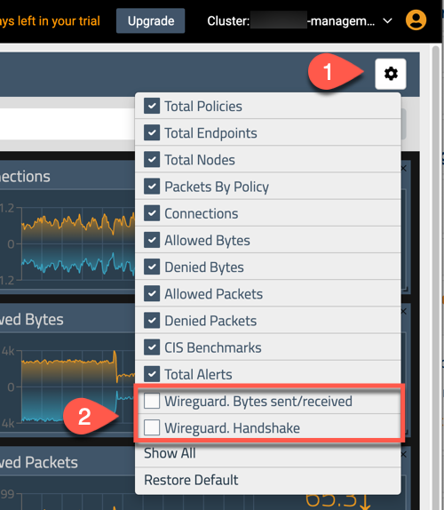
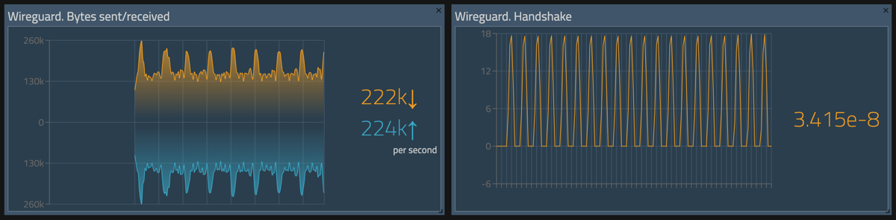

# Enabling End to End Encryption with WireGuard

## Installing WireGuard

Before enabling end-to-end encryption with Calico, you must first install WireGuard. Please refer to the instructions available here for your OS: https://www.wireguard.com/install/

Before enabling the encryption feature, test to ensure that the wireguard module is loaded on each of the 3 nodes (control1, worker1, worker2) using the following command:

```bash
sudo lsmod | grep wireguard
```

The output should look something like this:

```bash
ubuntu@ip-10-0-1-30:~$ sudo lsmod | grep wireguard
wireguard              81920  0
curve25519_x86_64      49152  1 wireguard
libchacha20poly1305    16384  1 wireguard
libblake2s             16384  1 wireguard
ip6_udp_tunnel         16384  1 wireguard
udp_tunnel             20480  1 wireguard
libcurve25519_generic    49152  2 curve25519_x86_64,wireguard
```

Now that we've enabled the wireguard module on the 3 nodes we can enable encrpytion through the 'felixconfiguration' in Calico.

## Enable End to End Encryption

To enable end-to-end encryption, we will patch the 'felixconfiguration' with the 'wireguardEnabled' option.

```bash
kubectl patch felixconfiguration default --type='merge' -p '{"spec":{"wireguardEnabled":true}}'
```

To validate, we will need to check the node status for Wireguard entries with the following command:

```bash
kubectl get nodes -o yaml | grep 'kubernetes.io/hostname\|Wireguard'
```

Which will give us the following output showing the nodes hostname as well as the Wireguard Interface Address and PublicKey:

```bash
tigera@bastion:~$ kubectl get nodes -o yaml | grep 'kubernetes.io/hostname\|Wireguard'
      projectcalico.org/IPv4WireguardInterfaceAddr: 10.48.115.87
      projectcalico.org/WireguardPublicKey: gsxCZHLjKBjJozxRFiKjbMB3QtVTluQDmbvQVfANmXE=
      kubernetes.io/hostname: ip-10-0-1-20.ca-central-1.compute.internal
            f:kubernetes.io/hostname: {}
            f:projectcalico.org/IPv4WireguardInterfaceAddr: {}
            f:projectcalico.org/WireguardPublicKey: {}
      projectcalico.org/IPv4WireguardInterfaceAddr: 10.48.127.254
      projectcalico.org/WireguardPublicKey: HmNsTyzg7TKvs/Fh0AmA0VEgtS+Ij6xBHqvzXO5VfmA=
      kubernetes.io/hostname: ip-10-0-1-30.ca-central-1.compute.internal
            f:kubernetes.io/hostname: {}
            f:projectcalico.org/IPv4WireguardInterfaceAddr: {}
            f:projectcalico.org/WireguardPublicKey: {}
      projectcalico.org/IPv4WireguardInterfaceAddr: 10.48.116.146
      projectcalico.org/WireguardPublicKey: lDSws3G/G1KP76BGGRpVSXBnTt5N6FCqOodzTUUWs0I=
      kubernetes.io/hostname: ip-10-0-1-31.ca-central-1.compute.internal
            f:kubernetes.io/hostname: {}
            f:projectcalico.org/IPv4WireguardInterfaceAddr: {}
            f:projectcalico.org/WireguardPublicKey: {}
```

On each node we can also view the new interface created by Wireguard with the 'wg' command:

```bash
ubuntu@ip-10-0-1-30:~$ sudo wg
interface: wireguard.cali
  public key: HmNsTyzg7TKvs/Fh0AmA0VEgtS+Ij6xBHqvzXO5VfmA=
  private key: (hidden)
  listening port: 51820
  fwmark: 0x200000

peer: gsxCZHLjKBjJozxRFiKjbMB3QtVTluQDmbvQVfANmXE=
  endpoint: 10.0.1.20:51820
  allowed ips: 10.48.115.64/26, 10.48.115.87/32, 10.0.1.20/32
  latest handshake: 1 minute, 26 seconds ago
  transfer: 22.09 MiB received, 12.46 MiB sent

peer: lDSws3G/G1KP76BGGRpVSXBnTt5N6FCqOodzTUUWs0I=
  endpoint: 10.0.1.31:51820
  allowed ips: 10.48.116.128/26, 10.48.116.146/32, 10.0.1.31/32
  latest handshake: 1 minute, 27 seconds ago
  transfer: 23.64 MiB received, 13.21 MiB sent
```

## Enable WireGuard Statistics

With end-to-end encryption enabled the next step is to enable statistics gathering in Prometheus. 

First, we'll patch the Tigera Operator to enable the 'nodeMetricsPort':
```bash
kubectl patch installation.operator.tigera.io default --type merge -p '{"spec":{"nodeMetricsPort":9091}}'
```

And then we'll apply 'Service', 'ServiceMonitor', and 'NetworkPolicy' manifests:

```yaml
cat <<EOF | kubectl apply -f -
---
apiVersion: v1
kind: Service
metadata:
  name: calico-prometheus-metrics
  namespace: calico-system
  labels:
    k8s-app: calico-node
spec:
  ports:
  - name: calico-prometheus-metrics-port
    port: 9091
    protocol: TCP
  selector:
    k8s-app: calico-node
---
apiVersion: monitoring.coreos.com/v1
kind: ServiceMonitor
metadata:
  generation: 1
  labels:
    team: network-operators
  name: calico-node-monitor-additional
  namespace: tigera-prometheus
spec:
  endpoints:
  - bearerTokenSecret:
      key: ""
    honorLabels: true
    interval: 5s
    port: calico-prometheus-metrics-port
    scrapeTimeout: 5s
  namespaceSelector:
    matchNames:
    - calico-system
  selector:
    matchLabels:
      k8s-app: calico-node
---
apiVersion: crd.projectcalico.org/v1
kind: NetworkPolicy
metadata:
  labels:
    projectcalico.org/tier: allow-tigera
  name: allow-tigera.prometheus-calico-node-prometheus-metrics-egress
  namespace: tigera-prometheus
spec:
  egress:
  - action: Allow
    destination:
      ports:
      - 9091
    protocol: TCP
    source: {}
  selector: app == 'prometheus' && prometheus == 'calico-node-prometheus'
  tier: allow-tigera
  types:
  - Egress
---
apiVersion: crd.projectcalico.org/v1
kind: NetworkPolicy
metadata:
  labels:
    projectcalico.org/tier: allow-tigera
  name: allow-tigera.calico-node-prometheus-metrics-ingress
  namespace: calico-system
spec:
  tier: allow-tigera
  selector: k8s-app == 'calico-node'
  types:
  - Ingress
  ingress:
  - action: Allow
    protocol: TCP
    source:
      selector: app == 'prometheus' && prometheus == 'calico-node-prometheus'
    destination:
      ports:
      - 9091
EOF
```
> Manifest File: [4.1-enable-wireguard-statistics.yaml](manifests/4.1-enable-wireguard-statistics.yaml)


And now we should be able to see the Wireguard stats on the Calico Cloud dashboard by enabling them through the configuration menu:

<p align="center">
  
</p>


The Dashboard should now show the Wireguard stastics:

<p align="center">
  
</p>


#### Reference Documentation

[Encrypt Data in Transit](https://docs.tigera.io/compliance/encrypt-cluster-pod-traffic)

[Install Wireguard](https://www.wireguard.com/install/)
