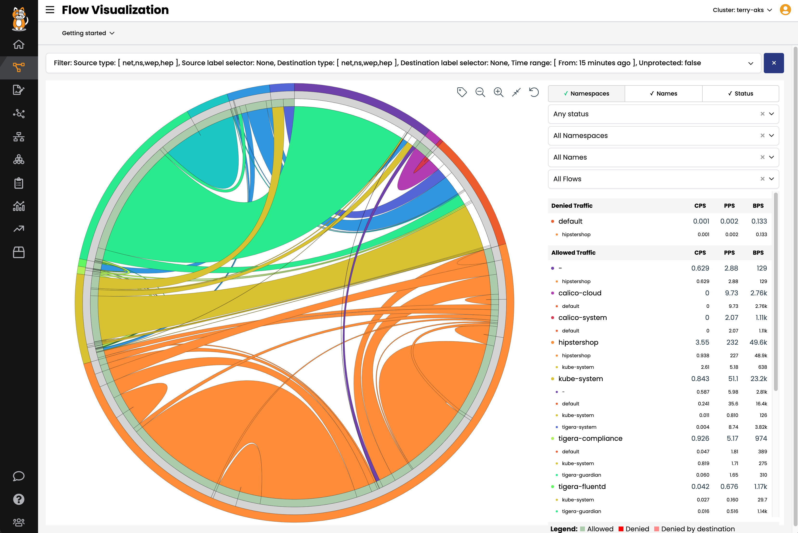
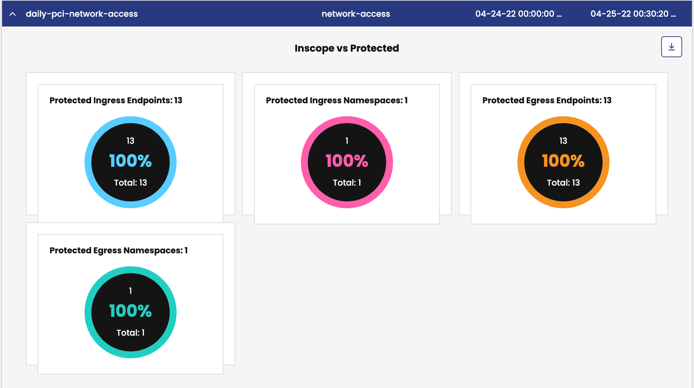

# 5. Reports & Visibility

With the policy portion of securing our application complete, we need a way to report that our application is in compliance going forward. There are two main tools for this within Calico Cloud:

## Increasing Log Flush Frequency

By default, flow logs will be flushed from the hosts and stored in Elasticsearch every 300s (5 minutes). During normal operation this default value will be adequate for troubleshooting and auditing. For this workshop, we will reduce our flow log flush interval to 30s to make it easier to see the results of our policies.

*Note - Increasing the frequency of logs sent to Elasticsearch will increase the storage usage.

```bash
kubectl patch felixconfiguration default --type='merge' -p '{"spec":{"flowLogsFlushInterval":"30s"}}'
```

## Visualizations

In Calico Cloud, there are two tools that help us provide visualizations of our cluster and traffic:Service Graph and Flow Visualizations.

### Service Graph

Service Graph is a graph of pod and service communication for all applications within the cluster. Allows for customized views to show relationships between namespaces, services, and deployments

<p align="center">
  
</p>

### Flow Visualization

Calico Cloud logs all network flows including source and destination namespaces, pods, labels, and the policies that evaluate each flow. Logs of all connection attempts (inside and outside the cluster) are automatically generated so you can quickly identify source of connectivity issues.

The Flow Visualizer lets you quickly drill down and pinpoint which policies are allowing and denying traffic between their services.

<p align="center">
  
</p>

### Flow Logs

Calico Cloud includes a fully-integrated deployment of Elasticsearch to collect flow log data that drives key features like the Flow Visualizer, metrics in the dashboard and Policy Board, policy automation and testing features, and security.

Calico Cloud also embeds Kibana to view raw log data for the traffic within your cluster. Kibana provides its own set of powerful filtering capabilities to quickly drilling into log data. For example, use filters to drill into flow log data for specific namespaces and pods. Or view details and metadata for a single flow log entry.

<p align="center">
  
</p>


## Reset Flow Log Flush Setting

Now that we've seen our traffic in the flow logs, lets reset our flow log flush interval to the default:

```bash
kubectl patch felixconfiguration default --type='merge' -p '{"spec":{"flowLogsFlushInterval":"300s"}}'
```

## Calico Cloud Reports

Using the reporting feature of Calico Cloud we can create a number of reports to satisfy the various SOC 2 reporting requirements.

Calico Cloud supports the following built-in report types:

- Inventory
- Network Access
- Policy-Audit
- CIS Benchmark

These reports can be customized to report against a certain set of endpoints (for example SOC2 endpoints).

Compliance reports provide the following high-level information:

- **Protection**
  - Endpoints explicitly protected using ingress or egress policy
  - Endpoints with Envoy enabled
- **Policies and services**
  - Policies and services associated with endpoints
  - Policy audit logs
- **Traffic**
  - Allowed ingress/egress traffic to/from namespaces
  - Allowed ingress/egress traffic to/from the internet

## Example Reports

### Daily Report - SOC2 Endpoint Inventory

The following report schedules daily inventory reports for all endpoints that have the 'soc2=true' label.

<p align="center">
  
</p>

```yaml
kubectl apply -f -<<EOF
apiVersion: projectcalico.org/v3
kind: GlobalReport
metadata:
  name: daily-soc2-inventory
spec:
  reportType: inventory
  endpoints:
    selector: soc2 == "true"
  schedule: 8 6 * * *
EOF
```
[SOC2 Inventory Endpoints Example](reports/daily-soc2-inventory-endpoints.csv)<br>
[SOC2 Inventory Summary Example](reports/daily-soc2-inventory-summary.csv)


### Daily Report - SOC2 Endpoint Network Access

The following report schedules daily network-access reports for all endpoints that have the 'soc2=true' label.

<p align="center">
  
</p>


```yaml
kubectl apply -f -<<EOF
apiVersion: projectcalico.org/v3
kind: GlobalReport
metadata:
  name: daily-soc2-network-access
spec:
  reportType: network-access
  endpoints:
    selector: soc2 == "true"
  schedule: 0 1 * * *
EOF
```

[SOC2 Network Access Endpoints Example](reports/daily-soc2-network-access-endpoints.csv)<br>
[SOC2 Network Access Summary Example](reports/daily-soc2-network-access-summary.csv)

### Generate reports manually

```
# for managed clusters you must set ELASTIC_INDEX_SUFFIX var to cluster name in the reporter pod template YAML
ELASTIC_INDEX_SUFFIX=$(kubectl get deployment -n tigera-intrusion-detection intrusion-detection-controller -ojson | jq -r '.spec.template.spec.containers[0].env[] | select(.name == "CLUSTER_NAME").value')

# on MacOS
START_TIME=$(date -v -2H -u +'%Y-%m-%dT%H:%M:%SZ')
END_TIME=$(date -u +'%Y-%m-%dT%H:%M:%SZ')
# on Linux
START_TIME=$(date -d '-2 hours' -u +'%Y-%m-%dT%H:%M:%SZ')
END_TIME=$(date -u +'%Y-%m-%dT%H:%M:%SZ')

# replace variables in YAML and deploy reporter jobs
sed   -e "s?<ELASTIC_INDEX_SUFFIX>?$ELASTIC_INDEX_SUFFIX?g" \
  -e "s?<TIGERA_COMPLIANCE_REPORT_START_TIME>?$START_TIME?g" \
  -e "s?<TIGERA_COMPLIANCE_REPORT_START_TIME>?$END_TIME?g" \
  5.\ Reports/manifests/compliance-reporter-pod.yaml | kubectl apply -f -
```


## Reference Documentation

[Calico Cloud Manager UI Tour](https://docs.tigera.io/calico-cloud/tutorials/calico-cloud-features/tour)

[Calico Enterprise Documentation for Compliance Reports](https://docs.tigera.io/compliance/overview)  

[Cron Scheduler Tool](https://crontab.guru/)  

[:arrow_right:6. Enabling End to End Encryption with WireGuard](../6.%20Encryption/readme.md)<br>

[:arrow_left:4. Apply Security Policies](../4.%20Policies/readme.md)

[:leftwards_arrow_with_hook: Back to Main](../README.md)  
