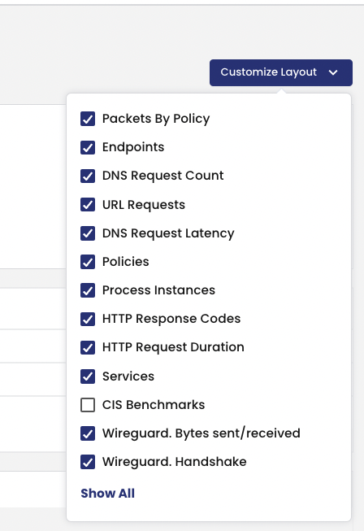
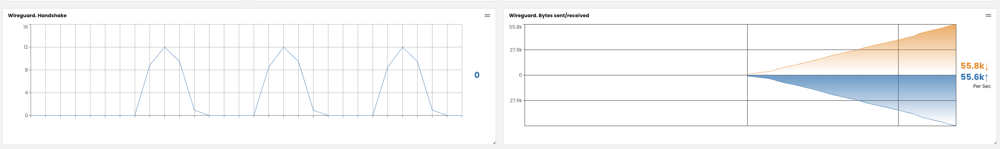

# 6. Enabling End to End Encryption with WireGuard

## Installing WireGuard

Before enabling end-to-end encryption with Calico, you must first install WireGuard. Please refer to the instructions available here for your OS: https://www.wireguard.com/install/

Before enabling the encryption feature, test to ensure that the wireguard module is loaded on each of the 2 worker nodes:


Get the first node's nodemane and save it to a variable
```
NODE_NAME=$(kubectl get nodes -o jsonpath='{.items[*].status.addresses[?(@.type=="Hostname")].address}'| awk '{print $1;}')
```

This command starts a privileged container on your node and connects to it over SSH:
```bash
kubectl debug node/$NODE_NAME -it --image=mcr.microsoft.com/aks/fundamental/base-ubuntu:v0.0.11
```
Output will be like:

```bash
Creating debugging pod node-debugger-aks-nodepool1-41939440-vmss000001-c9bjq with container debugger on node aks-nodepool1-41939440-vmss000001.
If you don't see a command prompt, try pressing enter.
```
Interact with the node session by running chroot /host from the privileged container.
```
root@aks-nodepool1-37054976-vmss000002:/# chroot /host
#
```
Run the following command:

```
lsmod | grep wireguard
```


The output should look something like this:

```bash
wireguard             217088  0
```

Now that we've enabled the wireguard module on the 3 nodes we can enable encrpytion through the 'felixconfiguration' in Calico.

## Enable End to End Encryption

To enable end-to-end encryption, we will patch the 'felixconfiguration' with the 'wireguardEnabled' option.

```bash
kubectl patch felixconfiguration default --type='merge' -p '{"spec":{"wireguardEnabled":true}}'
```

To validate, we will need to check the node status for Wireguard entries with the following command:

```bash
kubectl get nodes -o yaml | grep 'kubernetes.io/hostname\|Wireguard'
```

Which will give us the following output showing the nodes Wireguard public key

```bash
      projectcalico.org/WireguardPublicKey: 5qukt1/mog1Eq3B3R1AdwZMbrYTgxtseR4doUxFbckY=
      kubernetes.io/hostname: aks-nodepool1-37054976-vmss000002
      projectcalico.org/WireguardPublicKey: Ib4VKvg3cXgA59v66Q2q/+f5VQ9ub7PCj8RPyQsvfDg=
      kubernetes.io/hostname: aks-nodepool1-37054976-vmss000003
```

On each node we can also view the new interface created by Wireguard:

```
root@aks-nodepool1-37054976-vmss000002:/# ifconfig | grep wireguard
wireguard.cali: flags=209<UP,POINTOPOINT,RUNNING,NOARP>  mtu 1340
```

## Enable WireGuard Statistics

With end-to-end encryption enabled the next step is to enable statistics gathering in Prometheus. 

First, we'll patch the Tigera Operator to enable the 'nodeMetricsPort':
```bash
kubectl patch installation.operator.tigera.io default --type merge -p '{"spec":{"nodeMetricsPort":9091}}'
```

And then we'll apply 'Service', 'ServiceMonitor', and 'NetworkPolicy' manifests:

```yaml
cat <<EOF | kubectl apply -f -
---
apiVersion: v1
kind: Service
metadata:
  name: calico-prometheus-metrics
  namespace: calico-system
  labels:
    k8s-app: calico-node
spec:
  ports:
  - name: calico-prometheus-metrics-port
    port: 9091
    protocol: TCP
  selector:
    k8s-app: calico-node
---
apiVersion: monitoring.coreos.com/v1
kind: ServiceMonitor
metadata:
  generation: 1
  labels:
    team: network-operators
  name: calico-node-monitor-additional
  namespace: tigera-prometheus
spec:
  endpoints:
  - bearerTokenSecret:
      key: ""
    honorLabels: true
    interval: 5s
    port: calico-prometheus-metrics-port
    scrapeTimeout: 5s
  namespaceSelector:
    matchNames:
    - calico-system
  selector:
    matchLabels:
      k8s-app: calico-node
---
apiVersion: crd.projectcalico.org/v1
kind: NetworkPolicy
metadata:
  labels:
    projectcalico.org/tier: allow-tigera
  name: allow-tigera.prometheus-calico-node-prometheus-metrics-egress
  namespace: tigera-prometheus
spec:
  egress:
  - action: Allow
    destination:
      ports:
      - 9091
    protocol: TCP
    source: {}
  selector: app == 'prometheus' && prometheus == 'calico-node-prometheus'
  tier: allow-tigera
  types:
  - Egress
---
apiVersion: crd.projectcalico.org/v1
kind: NetworkPolicy
metadata:
  labels:
    projectcalico.org/tier: allow-tigera
  name: allow-tigera.calico-node-prometheus-metrics-ingress
  namespace: calico-system
spec:
  tier: allow-tigera
  selector: k8s-app == 'calico-node'
  types:
  - Ingress
  ingress:
  - action: Allow
    protocol: TCP
    source:
      selector: app == 'prometheus' && prometheus == 'calico-node-prometheus'
    destination:
      ports:
      - 9091
EOF
```
> Manifest File: [6.1-enable-wireguard-statistics.yaml](manifests/6.1-enable-wireguard-statistics.yaml)


And now we should be able to see the Wireguard stats on the Calico Cloud dashboard by enabling them through the configuration menu:

<p align="center">
  
</p>


The Dashboard should now show the Wireguard stastics:

<p align="center">
  
</p>


#### Reference Documentation

[Encrypt Data in Transit](https://docs.tigera.io/compliance/encrypt-cluster-pod-traffic)

[Install Wireguard](https://www.wireguard.com/install/)

[:arrow_right:7. Audit Logs](../7.%20Audit/readme.md)<br>

[:arrow_left:5. Reports and Visibility](../5.%20Reports/readme.md)

[:leftwards_arrow_with_hook: Back to Main](../README.md)  
