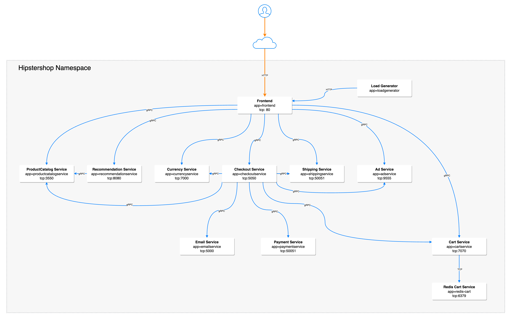

## 2. Policies

Kubernetes and Calico Network Policies are made up of three main components that all need to be properly designed and implemented to achieve compliance.

**Labels** - Tag Kubernetes objects for filtering.

**Network Policy** - The primary tool for securing a Kubernetes network. It lets you restrict network traffic in your cluster so only the traffic that you want to flow is allowed. Calico Cloud provides a more robust policy than Kubernetes, but you can use them together – seamlessly.

**Policy Tiers** - A hierarchical construct used to group policies and enforce higher precedence policies that cannot be circumvented by other teams.

## Labels

Instead of IP addresses and IP ranges, network policies in Kubernetes depend on labels and selectors to determine which workloads can talk to each other. Workload identity is the same for Kubernetes and Calico Cloud network policies: as pods dynamically come and go, network policy is enforced based on the labels and selectors that you define.

### Label Examples

First, lets manually apply a label to the multitool pod. 

```bash
kubectl label pod multitool mylabel=true
```

We can then see the result label using:

```bash
kubectl get pod multitool --show-labels

NAME        READY   STATUS    RESTARTS   AGE    LABELS
multitool   1/1     Running   0          2d6h   mylabel=true,run=multitool
```

Now lets use this to attach a PCI label to our application pods. Rather than apply the label one by one, label all pods in the hipstershop namespace with 'pci=true' with the following command:

```bash
kubectl label pods --all -n hipstershop pci=true
```

Then, verify the labels are applied:

```bash
tigera@bastion:~$ kubectl get pods -n hipstershop --show-labels
NAME                                     READY   STATUS    RESTARTS   AGE   LABELS
adservice-6569cd7bb6-v9v54               1/1     Running   0          28h   app=adservice,pci=true,pod-template-hash=6569cd7bb6
cartservice-f45c6bd9b-4h4pn              1/1     Running   22         28h   app=cartservice,pci=true,pod-template-hash=f45c6bd9b
checkoutservice-8596f74dc8-cj9vf         1/1     Running   0          28h   app=checkoutservice,pci=true,pod-template-hash=8596f74dc8
currencyservice-85599889d4-kspv5         1/1     Running   0          28h   app=currencyservice,pci=true,pod-template-hash=85599889d4
emailservice-78778f689b-dfljq            1/1     Running   0          28h   app=emailservice,pci=true,pod-template-hash=78778f689b
frontend-7cb647d79c-kz2gq                1/1     Running   0          28h   app=frontend,pci=true,pod-template-hash=7cb647d79c
loadgenerator-6cdf76b6d4-vscmj           1/1     Running   0          28h   app=loadgenerator,pci=true,pod-template-hash=6cdf76b6d4
multitool                                1/1     Running   0          28h   pci=true,run=multitool
paymentservice-868bc5ffcd-4k5sx          1/1     Running   0          28h   app=paymentservice,pci=true,pod-template-hash=868bc5ffcd
productcatalogservice-6948774f48-5xznt   1/1     Running   0          28h   app=productcatalogservice,pci=true,pod-template-hash=6948774f48
recommendationservice-cd689fc7d-h6w59    1/1     Running   0          28h   app=recommendationservice,pci=true,pod-template-hash=cd689fc7d
redis-cart-74594bd569-vg25j              1/1     Running   0          28h   app=redis-cart,pci=true,pod-template-hash=74594bd569
shippingservice-85c8d66568-jrdsf         1/1     Running   0          28h   app=shippingservice,pci=true,pod-template-hash=85c8d66568
```

Now that the pods are labelled, lets start applying some policy to them.

## Policy Tiers

Tiers are a hierarchical construct used to group policies and enforce higher precedence policies that cannot be circumvented by other teams. As part of your microsegmentation strategy, tiers let you apply identity-based protection to workloads and hosts. All Calico Enterprise and Kubernetes network policies reside in tiers.

For this workshop, we'll be creating 3 tiers in the cluster and utilizing the default tier as well:

**security** - Global security tier with controls such as PCI restrictions.

**platform** - Platform level controls such as DNS policy and tenant level isolation.

**app-hipster** - Application specific tier for microsegmentation inside the application.

To create the tiers apply the following manifest:

```yaml
apiVersion: projectcalico.org/v3
kind: Tier
metadata:
  name: app-hipstershop
spec:
  order: 400
---
apiVersion: projectcalico.org/v3
kind: Tier
metadata:
  name: platform
spec:
  order: 300
---   
apiVersion: projectcalico.org/v3
kind: Tier
metadata:
  name: security
spec:
  order: 200
```

### Network Policy

Now that we have our foundation in the Policy Tiers, we need to start applying policy to restrict traffic. The first policy we will apply will only allow traffic to flow between pods with the label of 'pci=true'. Pods without the 'pci=true' label will also be able to freely communicate with each other.

We will also add a 'pci-whitelist' policy because we need a way to allow traffic to the frontend of the application as well as allowing DNS lookups from the PCI pods to the kube-dns system.

```yaml
apiVersion: projectcalico.org/v3
kind: GlobalNetworkPolicy
metadata:
  name: security.pci-whitelist
spec:
  tier: security
  order: 0
  selector: all()
  namespaceSelector: ''
  serviceAccountSelector: ''
  ingress:
    - action: Allow
      protocol: TCP
      source: {}
      destination:
        selector: app == "frontend"
        ports:
          - '8080'
  egress:
    - action: Allow
      protocol: UDP
      source: {}
      destination:
        selector: k8s-app == "kube-dns"
        ports:
          - '53'
    - action: Allow
      protocol: TCP
      source: {}
      destination:
        selector: k8s-app == "kube-dns"
        ports:
          - '53'
  doNotTrack: false
  applyOnForward: false
  preDNAT: false
  types:
    - Ingress
    - Egress
---
apiVersion: projectcalico.org/v3
kind: GlobalNetworkPolicy
metadata:
  name: security.pci-restrict
spec:
  tier: security
  order: 0
  selector: pci == "true"
  namespaceSelector: ''
  serviceAccountSelector: ''
  ingress:
    - action: Allow
      source:
        selector: pci == "true"
      destination: {}
    - action: Deny
      source:
        selector: pci == "true"
      destination: {}
  egress:
    - action: Allow
      source: {}
      destination:
        selector: pci == "true"
    - action: Allow
      source: {}
      destination:
        selector: pci != "true"
  doNotTrack: false
  applyOnForward: false
  preDNAT: false
  types:
    - Ingress
    - Egress
```

Now we can verify this is working as expected.

### PCI Policy Testing

To test, we'll use our MultiTool pods both inside of the 'hipstershop' namespace and in the default namespace.

> For testing we will use two tools, curl and netcat.

> Curl will use the '-I' option to only return the header to keep the output short

> netcat will use the following:
> -z for Zero-I/O mode [used for scanning]
> -v for verbose
> -w 3 to limit the timeout to 3 seconds

First, fromom inside of the 'hipstershop' namespace, we'll exec into the multitool pod and connect to the 'frontend' as well as try to connect to the 'cartservice' directly. To do this we will use NetCat and Curl.

Exec into the pod:
```bash
kubectl exec -n hipstershop multitool --stdin --tty -- /bin/bash
```

Test connectivity to 'cartservice' directly:
```bash
bash-5.1# nc -zvw 3 10.49.133.111 7070
10.49.133.111 (10.49.133.111:7070) open
```
And connectivity to the 'frontend':
```bash
bash-5.1# curl -I 10.49.14.192
HTTP/1.1 200 OK
Set-Cookie: shop_session-id=1939f999-1237-4cc7-abdb-949423eae483; Max-Age=172800
Date: Wed, 26 Jan 2022 20:14:20 GMT
Content-Type: text/html; charset=utf-8
```

As expected, we can reach both services from a pod with the pci=true label.

Now lets try from a pod without the 'pci=true' label that is outside of the namespace.
```bash
bash-5.1# nc -zvw 3 10.49.133.111 7070
nc: 10.49.133.111 (10.49.133.111:7070): Operation timed out
```
```bash
bash-5.1# curl -I 10.49.14.192
HTTP/1.1 200 OK
Set-Cookie: shop_session-id=772c5095-11f5-4bb0-9d42-0ef8dcda9707; Max-Age=172800
Date: Wed, 26 Jan 2022 20:21:54 GMT
Content-Type: text/html; charset=utf-8
```

As expected, we can connect to 'frontend' because it has a policy allowing it but we can't connect to the cartservice on 7070 because of our PCI isolation policy.

Let's add the 'pci=true' label to the pod:

```bash
kubectl label pod multitool pci=true
```

And we can test again:

```bash
tigera@bastion:~$ kc exec multitool --stdin --tty -- /bin/bash
```
```bash
bash-5.1# nc -zvw 3 10.49.133.111 7070
10.49.133.111 (10.49.133.111:7070) open
```

We can successfully connect from the MultiTool pod in the default namespace to a service in the hipstershop namespace as long as they both have the 'pci=true' label.

## Tenant Isolation

If we need to further isolate the workloads in the cluster, for example in the case of multi-tenancy, we can start isolating based on properties such as namespace or a tenant label. 

Let's restrict access between those 'pci=true' resources even further starting with isolating the hipstershop namespace from outside traffic other than the frontend traffic.

To accomplish this, we will isolate our tenants within the cluster. In this case, our hipstershop will be a single tenant so we'll attach a tenant label to all of it's pods:

```bash
kubectl label -n hipstershop pod --all tenant=hipstershop
```

Now, we'll create a policy that only allows communication within this tenant label:

```yaml
apiVersion: projectcalico.org/v3
kind: GlobalNetworkPolicy
metadata:
  name: security.tenant-hipstershop
spec:
  tier: security
  order: -50
  selector: tenant == "hipstershop"
  namespaceSelector: ''
  serviceAccountSelector: ''
  ingress:
    - action: Allow
      protocol: TCP
      source: {}
      destination:
        selector: app == "frontend"
        ports:
          - '8080'
    - action: Allow
      source:
        selector: tenant == "hipstershop"
      destination: {}
    - action: Pass
      source: {}
      destination: {}
  egress:
    - action: Allow
      source: {}
      destination:
        selector: tenant == "hipstershop"
    - action: Allow
      protocol: UDP
      source: {}
      destination:
        ports:
          - '53'
    - action: Pass
      source: {}
      destination: {}
  doNotTrack: false
  applyOnForward: false
  preDNAT: false
  types:
    - Ingress
    - Egress

```

There are multiple ways to accomplish this, we could very easily have isolated traffic within the namespace as well. Isolating based on the tenant label in this scenario accomplishes our goal of isolating traffic within the hipstershop application.  We can verify by again testing using curl and netcat:

Testing from outside of the tenant label (Multitool Pod in the default namespace):
```bash
tigera@bastion:~$ kubectl exec multitool --stdin --tty -- /bin/bash
```
```bash
bash-5.1# nc -zvw 3 10.49.133.111 7070
nc: 10.49.133.111 (10.49.133.111:7070): Operation timed out
```
NetCat fails to connect to the cart service.

```bash
bash-5.1# curl -I 10.49.14.192
HTTP/1.1 200 OK
Set-Cookie: shop_session-id=90b6b2f4-c701-45c4-8a97-bb6ca5302a47; Max-Age=172800
Date: Wed, 26 Jan 2022 20:42:07 GMT
Content-Type: text/html; charset=utf-8
```
But HTTP traffic is still allowed by our 'pci-whitelist' rule.

Now we've successfully isolated the 'tenant=hipstershop' label but if exec into pod within the tenant we can still access services that we shouldn't be able to.

### Microsegmentation with Hipstershop

To perform the microsegmentation we will need to know more about how the application communicates between the services. The following diagram provides all the information we need to know:



After reviewing the diagram we can come up with a table of rules that looks like this:

Source Service | Destination Service | Destination Port
--- | --- | ---
cartservice | redis-cart | 6379
checkoutservice | cartservice | 7070
checkoutservice | emailservice | 8080
checkoutservice | paymentservice | 50051
checkoutservice | productcatalogservice | 3550
checkoutservice | shippingservice | 50051
checkoutservice | currencyservice | 7000
frontend | cartservice | 7070
frontend | productcatalogservice | 3550
frontend | recommendationservice | 8080
frontend | currencyservice | 7000
frontend | checkoutservice | 5050
frontend | shippingservice | 50051
frontend | adservice | 9555
loadgenerator | frontend | 80

This results in the following policy:

```yaml
apiVersion: projectcalico.org/v3
kind: NetworkPolicy
metadata:
  name: app-hipstershop.checkoutservice
  namespace: hipstershop
spec:
  tier: app-hipstershop
  order: 650
  selector: app == "checkoutservice"
  serviceAccountSelector: ''
  egress:
    - action: Allow
      protocol: TCP
      source: {}
      destination:
        ports:
          - '7070'
    - action: Allow
      protocol: TCP
      source: {}
      destination:
        selector: app == "emailservice"
        ports:
          - '8080'
    - action: Allow
      protocol: TCP
      source: {}
      destination:
        selector: app == "paymentservice"
        ports:
          - '50051'
    - action: Allow
      protocol: TCP
      source: {}
      destination:
        selector: app == "productcatalogservice"
        ports:
          - '3550'
    - action: Allow
      protocol: TCP
      source: {}
      destination:
        selector: app == "shippingservice"
        ports:
          - '50051'
    - action: Allow
      protocol: TCP
      source: {}
      destination:
        selector: app == "currencyservice"
        ports:
          - '7000'
  types:
    - Egress
---
apiVersion: projectcalico.org/v3
kind: NetworkPolicy
metadata:
  name: app-hipstershop.cartservice
  namespace: hipstershop
spec:
  tier: app-hipstershop
  order: 875
  selector: app == "cartservice"
  serviceAccountSelector: ''
  ingress:
    - action: Allow
      protocol: TCP
      source:
        selector: app == "checkoutservice"
      destination:
        ports:
          - '7070'
    - action: Allow
      protocol: TCP
      source:
        selector: app == "frontend"
      destination:
        ports:
          - '7070'
  egress:
    - action: Allow
      protocol: TCP
      source: {}
      destination:
        selector: app == "redis-cart"
        ports:
          - '6379'
  types:
    - Ingress
    - Egress
---
apiVersion: projectcalico.org/v3
kind: NetworkPolicy
metadata:
  name: app-hipstershop.frontend
  namespace: hipstershop
spec:
  tier: app-hipstershop
  order: 1100
  selector: app == "frontend"
  serviceAccountSelector: ''
  ingress:
    - action: Allow
      protocol: TCP
      source: {}
      destination:
        ports:
          - '8080'
  egress:
    - action: Allow
      protocol: TCP
      source: {}
      destination:
        selector: app == "cartservice"
        ports:
          - '7070'
    - action: Allow
      protocol: TCP
      source: {}
      destination:
        selector: app == "productcatalogservice"
        ports:
          - '3550'
    - action: Allow
      protocol: TCP
      source: {}
      destination:
        selector: app == "recommendationservice"
        ports:
          - '8080'
    - action: Allow
      protocol: TCP
      source: {}
      destination:
        selector: app == "currencyservice"
        ports:
          - '7000'
    - action: Allow
      protocol: TCP
      source: {}
      destination:
        selector: app == "checkoutservice"
        ports:
          - '5050'
    - action: Allow
      protocol: TCP
      source: {}
      destination:
        selector: app == "shippingservice"
        ports:
          - '50051'
    - action: Allow
      protocol: TCP
      source: {}
      destination:
        selector: app == "adservice"
        ports:
          - '9555'
  types:
    - Ingress
    - Egress
---
apiVersion: projectcalico.org/v3
kind: NetworkPolicy
metadata:
  name: app-hipstershop.redis-cart
  namespace: hipstershop
spec:
  tier: app-hipstershop
  order: 1300
  selector: app == "redis-cart"
  serviceAccountSelector: ''
  ingress:
    - action: Allow
      protocol: TCP
      source:
        selector: app == "cartservice"
      destination:
        ports:
          - '6379'
  types:
    - Ingress
---
apiVersion: projectcalico.org/v3
kind: NetworkPolicy
metadata:
  name: app-hipstershop.productcatalogservice
  namespace: hipstershop
spec:
  tier: app-hipstershop
  order: 1400
  selector: app == "productcatalogservice"
  serviceAccountSelector: ''
  ingress:
    - action: Allow
      protocol: TCP
      source:
        selector: app == "checkoutservice"
      destination:
        ports:
          - '3550'
  types:
    - Ingress
---
apiVersion: projectcalico.org/v3
kind: NetworkPolicy
metadata:
  name: app-hipstershop.emailservice
  namespace: hipstershop
spec:
  tier: app-hipstershop
  order: 1500
  selector: app == "emailservice"
  serviceAccountSelector: ''
  ingress:
    - action: Allow
      protocol: TCP
      source:
        selector: app == "checkoutservice"
      destination:
        ports:
          - '8080'
  types:
    - Ingress
---
apiVersion: projectcalico.org/v3
kind: NetworkPolicy
metadata:
  name: app-hipstershop.paymentservice
  namespace: hipstershop
spec:
  tier: app-hipstershop
  order: 1600
  selector: app == "paymentservice"
  serviceAccountSelector: ''
  ingress:
    - action: Allow
      protocol: TCP
      source:
        selector: app == "checkoutservice"
      destination:
        ports:
          - '50051'
  types:
    - Ingress
---
apiVersion: projectcalico.org/v3
kind: NetworkPolicy
metadata:
  name: app-hipstershop.currencyservice
  namespace: hipstershop
spec:
  tier: app-hipstershop
  order: 1650
  selector: app == "currencyservice"
  serviceAccountSelector: ''
  ingress:
    - action: Allow
      protocol: TCP
      source:
        selector: app == "checkoutservice"
      destination:
        ports:
          - '7000'
  types:
    - Ingress
---
apiVersion: projectcalico.org/v3
kind: NetworkPolicy
metadata:
  name: app-hipstershop.shippingservice
  namespace: hipstershop
spec:
  tier: app-hipstershop
  order: 1700
  selector: app == "shippingservice"
  serviceAccountSelector: ''
  ingress:
    - action: Allow
      protocol: TCP
      source:
        selector: app == "checkoutservice"
      destination:
        ports:
          - '50051'
  types:
    - Ingress

```

We will have to go back and make a modification to our PCI policy though to completely enable our microsegmentation. Right now it allows communication between all the pci=true pods. We want to pass this decision to the app-hipstershop tier so we will apply the following update:

```yaml
apiVersion: projectcalico.org/v3
kind: GlobalNetworkPolicy
metadata:
  name: security.pci-restriction
spec:
  tier: security
  order: 75
  selector: pci == "true"
  namespaceSelector: ''
  serviceAccountSelector: ''
  ingress:
    - action: Pass
      source:
        selector: pci == "true"
      destination: {}
    - action: Deny
      source:
        selector: pci != "true"
      destination: {}
  egress:
    - action: Pass
      source: {}
      destination:
        selector: pci == "true"
    - action: Deny
      source: {}
      destination:
        selector: pci != "true"
  doNotTrack: false
  applyOnForward: false
  preDNAT: false
  types:
    - Ingress
    - Egress
```


#### Reference Documentation

